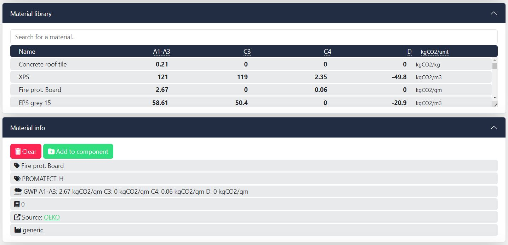

# oekobaudat-py
oekobudat-py is a jupyter notebook used to manipulate data from oekobaudat library of Environmental Product Declarations of building materials ( https://www.oekobaudat.de/en/service/downloads.html ). 
The notebook selects part of the data, adds language translations, and convert the data into the format needed by the SLAD.ai - carbon calculation tool for architects webapp. 

*Usage of the extracted data from this jupyter notebook on the https://slad.ai website*
